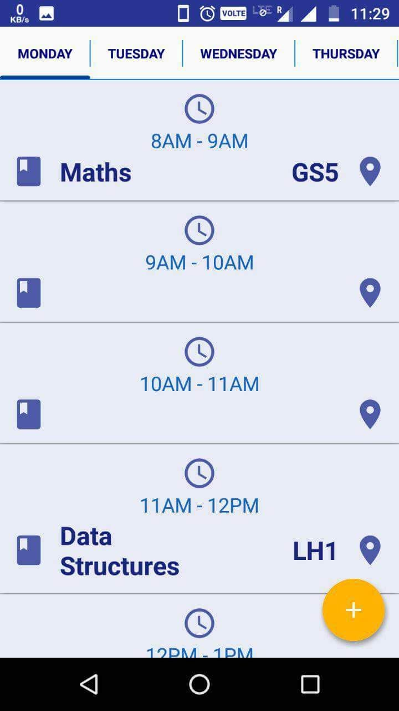
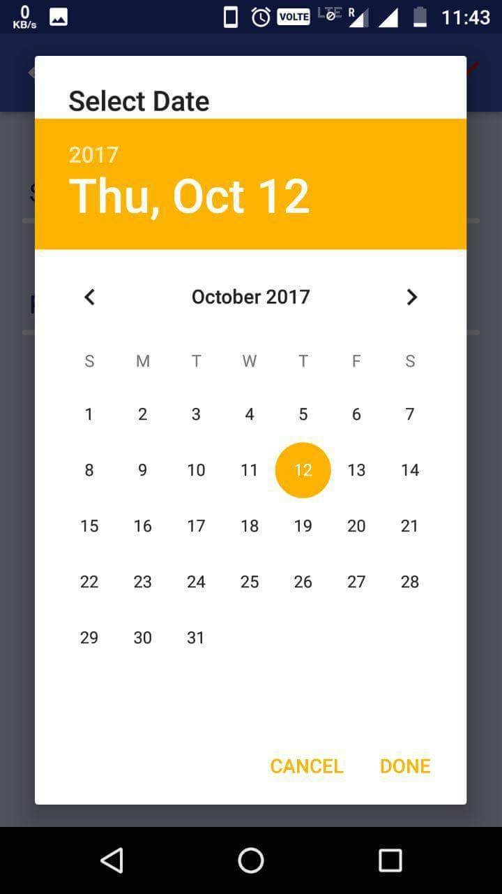

# Timetable App ⏰📚

A simple Android application that helps students manage their daily timetable with ease.  
Built using **Java, XML, and Android Studio** with a clean light theme UI.

---

## ✨ Features
- 📅 Automatically shows the timetable for the **current day**
- ✏️ Easy editing of subjects and timings
- 🔔 Sends notifications for upcoming classes
- 🖼️ Simple and clean UI for smooth user experience

---

## 📸 Screenshots
<p align="center">
  
  
  
</p>

---

## ⚙️ Installation
1. Clone the repository  
   ```bash
   git clone https://github.com/abhishek7482835355/timetable-app.git
